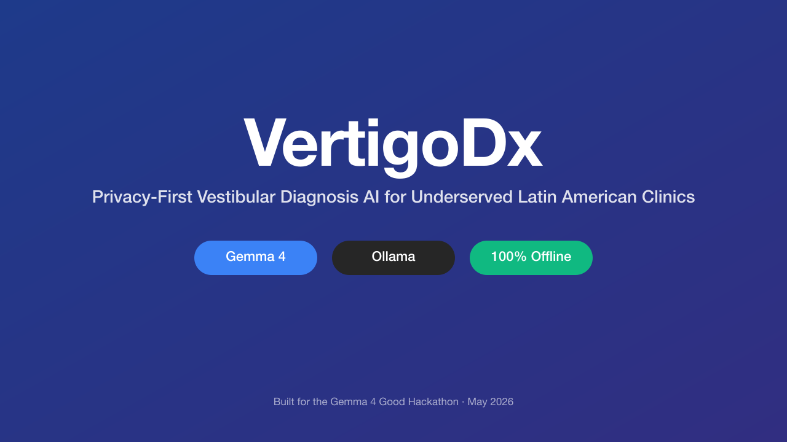
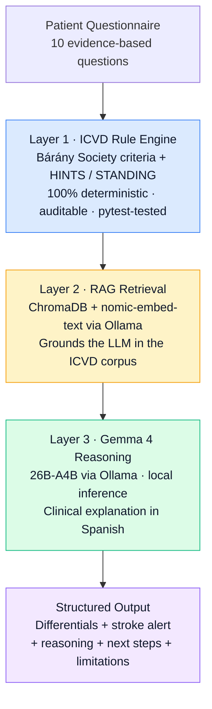
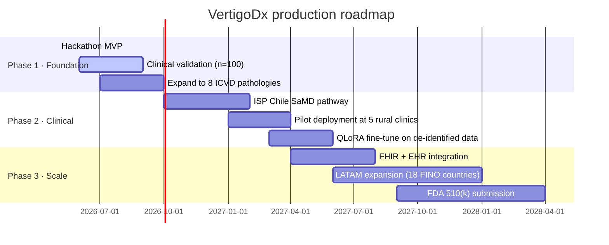

<div align="center">



# VertigoDx

### Privacy-first vestibular diagnosis AI for underserved Latin American clinics

**Subspecialist reasoning. Anywhere. Offline. Powered by Gemma 4 + Ollama.**

[](https://deepmind.google/models/gemma/gemma-4/)
[](https://ollama.com)
[](LICENSE)
[](https://www.python.org)
[](https://nextjs.org)
[](https://fastapi.tiangolo.com)
[](https://www.trychroma.com)
[](CONTRIBUTING.md)
[](SECURITY.md)
[](https://www.kaggle.com/competitions/gemma-4-good-hackathon)

[**Demo video**](#see-it-in-action) · [**Quickstart**](#quickstart-60-seconds) · [**Architecture**](#how-it-works) · [**Roadmap**](#roadmap) · [**Limitations**](#honest-limitations) · [**Contributing**](CONTRIBUTING.md)

</div>

---

> _"Three hours by bus from the nearest MRI. No neurologist. No internet. A primary care physician and a patient with acute vertigo — is it benign positional vertigo, or a cerebellar stroke with 40% mortality?"_
>
> **VertigoDx answers that question. Locally. In Spanish. Offline.**

---

## The problem

<table>
<tr>
<td width="50%" valign="top">

### What the data says

- **35–40%** of vestibular strokes are missed in emergency rooms<sup>[1]</sup>
- **3–5 years** is the average diagnostic odyssey for chronic vertigo patients<sup>[2]</sup>
- **4–5 doctors** consulted on average before correct diagnosis<sup>[2]</sup>
- **$48.1B/year** estimated US economic burden of vertigo-related care<sup>[3]</sup>

</td>
<td width="50%" valign="top">

### What that means for LATAM

- **<30** otoneurology subspecialists in Chile (population: 19M), almost all in Santiago<sup>[4]</sup>
- **260,757** patients on ENT specialist waitlists in Chile<sup>[5]</sup>
- **Zero** national vestibular triage guidelines in Latin America (except ACORL Colombia 2024)
- **~20%** of general practitioners feel trained to diagnose BPPV — the most common and most treatable cause<sup>[6]</sup>

</td>
</tr>
</table>

There is a 5-minute bedside examination called **HINTS** that detects vestibular stroke with **higher sensitivity than an early MRI** (100% vs 47%)<sup>[7]</sup>. Most ER physicians don't know how to perform it correctly.

**VertigoDx encodes that subspecialist reasoning and runs it on a laptop, in a rural clinic, without an internet connection.**

---

## What it does

A primary care physician answers **10 evidence-based questions** about a vertigo patient. In under 5 seconds, VertigoDx returns:

| | |
|---|---|
| **Top-3 differential diagnoses** | With confidence levels and ICVD criteria citations |
| **Stroke alert badge** | Triggered when HINTS-adapted + Sudbury scores cross threshold |
| **Clinical reasoning in Spanish** | Generated by Gemma 4, grounded in retrieved Bárány Society criteria |
| **Concrete next clinical steps** | Epley maneuver, urgent referral, audiometry, neuroimaging |
| **Honest limitations** | What additional data would strengthen the diagnosis |

All running locally on the clinician's machine. **No patient data ever leaves the device.**

There is also a `POST /diagnose/stream` endpoint that emits Server-Sent Events for each pipeline stage (`rules` → `triage` → `rag` → `reasoning`), so the UI shows the system thinking in real time instead of spinning silently during the 3-5-second Gemma inference. When the stroke alert triggers, an extra `model_loading` event tells the frontend the heavy `26B` model is being swapped in.

---

## How it works

VertigoDx uses a **3-layer architecture with graceful degradation** — every layer adds value, and the system keeps working even if the upper layers fail.



### Why this design

| Layer | Why it matters |
|---|---|
| **Rule engine first** | Deterministic, testable with pytest, fully auditable for clinical safety. The diagnosis pool comes from ICVD criteria — not from an LLM. |
| **RAG in the middle** | Reduces LLM hallucinations from ~43% to <1% by grounding responses in retrieved Bárány Society criteria<sup>[8]</sup>. |
| **Gemma 4 last** | The LLM explains and contextualizes — it does not invent diagnoses. Native JSON output mode returns structured medical results; 140+ language support delivers fluent Spanish clinical reasoning. |
| **Local-first** | Privacy-by-design via Ollama. Critical for Latin American public health systems where Chile's Law 21.719 (GDPR-aligned) takes effect December 2026. |

---

## Quickstart (60 seconds)

### Prerequisites

- macOS or Linux (primarily tested on Apple Silicon M-series, 24 GB RAM)
- **24 GB RAM recommended** (16 GB minimum if you fall back to the E4B model)
- ~25 GB free disk space for models
- Python 3.11+ and Node.js 20+

### Install and run

```bash
# 1. Install Ollama and pull the models
brew install ollama
brew services start ollama
ollama pull gemma4:26b-a4b-it-q4_K_M    # primary model, ~18 GB
ollama pull gemma4:e4b                  # fallback for lower-memory hosts, ~5 GB
ollama pull nomic-embed-text            # local embeddings for RAG, ~274 MB

# 2. Backend
git clone https://github.com/manuelpenazuniga/vertigoDx.git
cd vertigoDx/backend
python -m venv .venv && source .venv/bin/activate
pip install -e ".[dev]"
uvicorn app.main:app --port 8000 --reload

# 3. Frontend (in another terminal)
cd ../frontend
npm install && npm run dev

# 4. Open http://localhost:3000 and click "Ver casos demo"
```

### Smoke test the API

```bash
curl -X POST http://localhost:8000/diagnose \
  -H "Content-Type: application/json" \
  -d '{
    "episode_duration": "over_24h",
    "trigger": "spontaneous",
    "hearing_status": "none",
    "migraine_history": "none",
    "nausea_vomiting": "vomiting",
    "age_bracket": "60_75",
    "onset": "sudden",
    "gait": "cant_sit",
    "neuro_red_flags": true,
    "cv_risk": "3_or_more"
  }' | jq
```

Expected result: `stroke_alert.triggered: true`, `urgency: "inmediata"`, Spanish clinical reasoning citing truncal ataxia and HINTS.

---

## Load-aware model autoscaler

VertigoDx runs on commodity hardware (the reference machine is a Mac M4 with 24 GB of unified memory). Keeping the 17 GB `gemma4:26b-a4b-it-q4_K_M` model hot in RAM for every request leaves too little headroom for the OS, the editor, the browser, and the recording tools — the demo machine becomes laggy.

To keep the clinical quality high *and* the system responsive, the LLM client picks a Gemma variant per request:

| Request profile | Model used | Why |
|---|---|---|
| Non-stroke case (`stroke_alert.triggered == false`) | `gemma4:e4b` (≈ 9.6 GB) | Fast, cheap, leaves plenty of RAM headroom. Clinical quality is sufficient for BPPV / Ménière / Vestibular Migraine cases. |
| Stroke case (`stroke_alert.triggered == true`) | `gemma4:26b-a4b-it-q4_K_M` (≈ 17 GB) | Reserved for the cases where reasoning quality matters most — mortality risk decisions. |
| `VERTIGODX_FORCE_HEAVY=1` set | Always the heavy model | Pin for video recording day, so the model on screen is consistent across all demo cases. |

Two Ollama service settings act as guardrails so the two models never co-reside in RAM:

```bash
launchctl setenv OLLAMA_MAX_LOADED_MODELS 1   # loading 26b auto-evicts e4b first
launchctl setenv OLLAMA_NUM_PARALLEL 1        # one inference at a time
launchctl setenv OLLAMA_KEEP_ALIVE 60s        # unload from RAM 60s after the last request
```

Verify the autoscaler is enabled:

```bash
curl -s http://localhost:8000/healthcheck | jq
# {
#   "model_light": "gemma4:e4b",
#   "model_heavy": "gemma4:26b-a4b-it-q4_K_M",
#   "autoscaler": "stroke-triggered routes to heavy; otherwise light",
#   "offline": true
# }
```

The implementation lives in [`backend/app/llm.py`](backend/app/llm.py) — `pick_model()` is the single decision point. The triage layer (`triage.py`) decides whether the stroke flag is on; the LLM client then routes accordingly. No model selection logic leaks into the frontend.

---

## See it in action

The 3-minute demo walks through five real-world scenarios:

1. **Classic BPPV in a 52-year-old** — Epley maneuver recommended
2. **Probable Ménière's disease** with fluctuating hearing loss
3. **Vestibular migraine** in a young woman with photophobia
4. **Cerebellar stroke** — the dramatic case. Watch the red alert trigger.
5. **VM + Ménière comorbidity** — where Gemma's reasoning shines

> 🎥 **Demo video will be embedded here after upload.** Submitted to the Gemma 4 Good Hackathon · May 2026.

---

## Project structure

```
vertigoDx/
├── backend/                FastAPI application
│   ├── app/
│   │   ├── main.py         FastAPI app + endpoints
│   │   ├── rules.py        Deterministic ICVD rule engine (4 pathologies)
│   │   ├── triage.py       HINTS / STANDING / Sudbury stroke risk scores
│   │   ├── rag.py          ChromaDB + Ollama embedder
│   │   ├── llm.py          Gemma 4 client via Ollama
│   │   ├── prompts.py      Versioned system prompts
│   │   ├── schemas.py      Pydantic models for typed I/O
│   │   └── data/
│   │       └── icvd_corpus.md  ICVD criteria corpus used for RAG
│   └── tests/              pytest — 5 demo cases as ground truth
├── frontend/               Next.js 14 (App Router) + shadcn/ui
│   ├── app/                Pages: landing, /diagnose, /demo, /result
│   └── components/         QuestionWizard, ResultPanel, StrokeAlert, OfflineBadge
├── data/
│   └── demo_cases.json     5 scripted clinical cases (the video script)
├── backlog.yaml            Machine-readable execution backlog (4-day plan)
├── CLAUDE.md               Repository invariants for AI coding agents
├── AGENT_HANDOFF.md        Scoped task assignment for delegated sub-agents
├── CONTRIBUTING.md         How to contribute (post-hackathon)
├── SECURITY.md             Vulnerability + clinical-safety reporting
├── LICENSE                 Apache 2.0 (matches Gemma 4)
└── README.md               You are here
```

---

## Tech stack

<table>
<tr>
<td valign="top" width="33%">

**AI layer**
- Gemma 4 `26b-a4b-it-q4_K_M` (primary)
- Gemma 4 `e4b` (fallback)
- `nomic-embed-text` (embeddings)
- All via [Ollama](https://ollama.com) on `localhost:11434`

</td>
<td valign="top" width="33%">

**Backend**
- Python 3.11+
- FastAPI + Pydantic v2
- ChromaDB (in-memory)
- httpx (E2E tests)
- pytest for clinical case validation
- ruff for linting

</td>
<td valign="top" width="33%">

**Frontend**
- Next.js 14 (App Router)
- TypeScript (strict mode)
- shadcn/ui + Tailwind CSS
- Framer Motion (transitions)
- lucide-react (icons)

</td>
</tr>
</table>

---

## Clinical foundation

VertigoDx is built on peer-reviewed clinical evidence:

- **ICVD criteria** — International Classification of Vestibular Disorders, [Bárány Society](https://www.thebaranysociety.org)
- **HINTS+ algorithm** — Kattah et al., *Stroke* 2009 (100% sensitivity for posterior fossa stroke)
- **STANDING protocol** — Vanni et al., *Acad Emerg Med* 2014 (95% sensitivity, 87% specificity for central cause)
- **TiTrATE framework** — Newman-Toker & Edlow, *Neurol Clin* 2015
- **GRACE-3 guidelines** — Edlow et al., *Acad Emerg Med* 2023
- **Ataxia grade-3 specificity** — Carmona & Kaski, *Eur J Neurol* 2023

### Pathologies covered in this MVP

| # | Pathology | Why included |
|---|---|---|
| 1 | **BPPV (posterior canal)** | 28% prevalence, highly treatable with the Epley maneuver |
| 2 | **Vestibular migraine** | 28% prevalence, frequently misdiagnosed without training |
| 3 | **Ménière's disease** | 14% prevalence, decision-critical for invasive treatments |
| 4 | **Central vertigo (stroke)** | The mortality case — 35-40% miss rate in ER |

Together: **~70% of vertigo cases** seen in primary care.

---

## Honest limitations

This is a **hackathon MVP**, not a clinically validated medical device. Specifically:

- **Not validated** against a real patient cohort yet — synthetic cases only
- **Only 4 of 15** ICVD-defined vestibular pathologies are implemented
- **No regulatory clearance** (SaMD pathway defined in the roadmap below)
- **No EHR integration** (architecture is FHIR-ready, but not implemented)
- **Spanish-only** for now — Portuguese and English are on the roadmap
- **Decision support, not diagnosis** — final diagnosis always remains with the clinician

**Do not use this MVP for actual clinical decisions.** The 12-month production roadmap is summarized in the next section.

---

## Roadmap



**Beyond the hackathon:** the same architecture is designed to extend to all 15 ICVD pathologies, integrate with public-health EHRs (RAYEN, TrakCare), and eventually pursue SaMD (Software as a Medical Device) clearance with ISP Chile and the FDA.

---

## Contributing

This is an active hackathon project. After **May 18, 2026** (submission deadline), we welcome contributions from:

- **Otoneurology subspecialists** — clinical validation, case curation
- **Latin American clinicians** — country-specific adaptation (🇨🇱 🇲🇽 🇨🇴 🇧🇷 🇦🇷)
- **Developers** — improving the rule engine, expanding ICVD coverage, building EHR adapters
- **Translators** — Portuguese (Brazil), Quechua, Mapudungun

Open an issue or reach out via GitHub: [@manuelpenazuniga](https://github.com/manuelpenazuniga).

---

## License and citation

VertigoDx is released under the **[Apache License 2.0](LICENSE)**, the same license as Gemma 4 itself.

If you use VertigoDx in research, please cite:

```bibtex
@software{vertigodx2026,
  title  = {VertigoDx: Privacy-First Vestibular Diagnosis AI
            for Latin American Primary Care},
  author = {Pe{\~n}a Z{\'u}{\~n}iga, Manuel and {VertigoDx Clinical Team}},
  year   = {2026},
  url    = {https://github.com/manuelpenazuniga/vertigoDx},
  note   = {Submitted to the Gemma 4 Good Hackathon}
}
```

---

## Acknowledgments

- **Google DeepMind** for releasing Gemma 4 under Apache 2.0
- **Ollama** for making local LLM inference effortless
- **The Bárány Society** for the ICVD criteria that ground this work
- **The otoneurology subspecialist team** supervising VertigoDx's clinical design and case validation
- The Latin American GPs whose stories shaped this MVP — especially those serving rural communities in Chile's Maule and Biobío regions

---

## References

1. Tarnutzer AA, et al. (2017). ED misdiagnosis of cerebrovascular events in vertigo presentations. *Neurology*. Meta-analysis of 15,721 patients.
2. Rafati A, et al. (2024). Vestibular patient journey: insights from the VeDA registry. *Ann Clin Transl Neurol*.
3. Ruthberg JS, et al. (2021). The economic burden of vertigo and dizziness in the United States. *J Vestib Res*.
4. IPSUSS (2024). ENT specialist density and waitlists in Chile.
5. Chilean Ministry of Health public waitlist data, 2024.
6. Bisdorff A, et al. Swiss GP self-reported competence in BPPV diagnosis.
7. Kattah JC, et al. (2009). HINTS to diagnose stroke in the acute vestibular syndrome. *Stroke*.
8. Garg R, et al. (2025). Grounding LLMs in clinical evidence: a RAG system for NICE guidelines. *arXiv*:2510.02967.

---

<div align="center">

### Built for the Gemma 4 Good Hackathon · May 2026

**VertigoDx** · Subspecialist reasoning. Anywhere. Offline.

[⭐ Star this repo](https://github.com/manuelpenazuniga/vertigoDx) · [🐛 Report issues](https://github.com/manuelpenazuniga/vertigoDx/issues) · [Apache 2.0](LICENSE)

</div>
